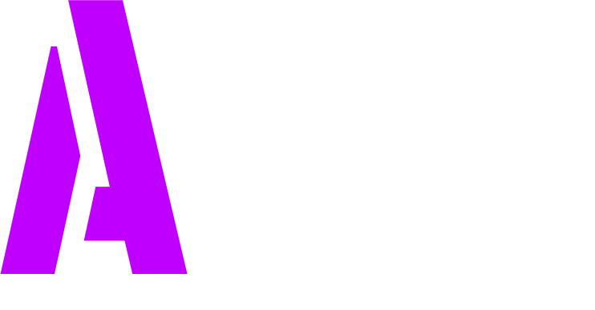

  

## 📄 Description

### 🚨 Note: Aegis is still in Pre-beta phase so **DO NOT USE IT IN PRODUCTION SERVERS**.

Aegis is a free and open-source next-generation anticheat plugin for Spigot, Paper, and their forks.  
It provides reliable cheat detection with minimal server impact, designed to keep your Minecraft server fair and enjoyable.

---

## 💡 Features

- Advanced cheat detection
- Multi-version support (Spigot, Paper, and forks)  
- Lightweight and performant  
- Open-source and community-driven  

---

## 💻 Installation

1. Download the latest release from the [Releases](https://github.com/Nerd10000/Aegis/releases) page. 
  Or use the offical Spigot page where the stable versions will be released.
3. Place the `.jar` file into your server's `plugins` folder.  
4. Restart or reload your server.  
5. Configure the plugin by editing the config files in `plugins/Aegis`.

---

## 🔌 Usage

- Once installed, the anticheat will start monitoring players automatically.  
- Customize detection settings in the config file to suit your server needs.  
- Use commands like `/aegis reload` to reload the configuration without restarting.

---

## 🤗 Contributing

Contributions are welcome! If you'd like to help improve Aegis:

1. Fork the repository.  
2. Create a new branch for your feature or fix.  
3. Submit a pull request describing your changes.  

Please make sure your code follows the existing style and includes proper documentation.

---

## ⚠️ License

This project is licensed under the GPL v3 License. See the [LICENSE](LICENSE) file for details.

---

## 📞 Contact

For questions, suggestions, or support, please open an issue on GitHub.

---

*Thank you for using Aegis!*
